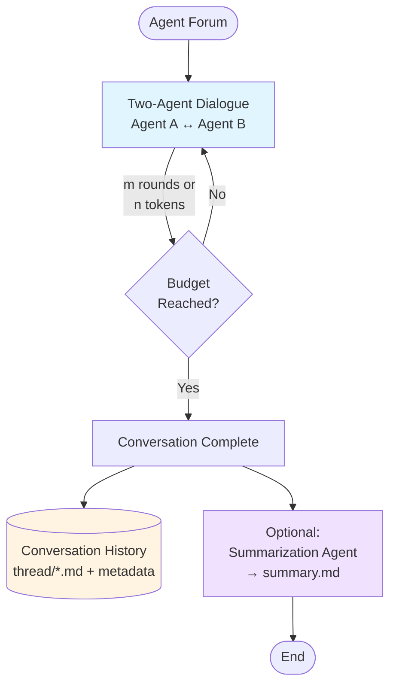

# 🏛️ Agent Forum


A TypeScript library for enabling AI Agents to communicate with each other in structured conversations.

### Example

```typescript
import {Forum} from "./src/forum";
import {openai} from "@ai-sdk/openai";

const forum = new Forum({
  threadName: "domain-discovery",
  rounds: 4,
  maxTokens: 30000,
  agents: [
    {
      agentId: "domain-expert",
      model: openai("gpt-5"),
      personality: "You are an expert in music streaming domain...",
    },
    {
      agentId: "software-architect",
      model: openai("gpt-5-mini"),
      personality: "You are a software architect...",
    },
  ],
  summarizer: {
    agentId: "ddd-analyst",
    model: openai("gpt-5-mini"),
    personality: (state) => `Analyze this conversation and provide insights...`,
  },
});

const result = await forum.runForum();
```

## Mental Model




The Agent Forum operates within simple mental model:

### 1. **Two-Agent Dialogue**
The core of the forum is a structured conversation between **two agents** with complementary roles. Think of it as a focused dialogue where:
- One agent might be a **domain expert** who knows the subject matter deeply
- The other might be a **knowledge extractor** or **analyst** who asks questions and probes for details
- They exchange messages back and forth for a defined number of rounds
- Each message builds on the previous conversation context

### 2. **Conversation History**
All messages are captured and stored as markdown files in a thread directory, creating a complete audit trail of the dialogue. Each message includes:
- The agent's response
- Metadata (timestamp, token usage, etc.)
- Full conversation context up to that point

### 3. **Summarization Layer**
After the two-agent conversation completes, an optional **summarizer agent** processes the entire dialogue. The summarizer:
- Has access to the complete conversation history
- Can be prompted to produce any desired output format (PRD, analysis, action items, etc.)
- Generates a `summary.md` file based on its specific prompt
- Acts as a distillation or transformation layer - turning raw dialogue into structured deliverables
- Adding summarization step is optional, but it is a powerful way to produce structured outputs from the conversation.

This architecture separates **exploration** (two-agent dialogue) from **synthesis** (summarization), allowing you to have organic conversations while still producing structured outputs.

## Current Status

- [X] Core functionality works within the repository
- [ ] Published as standalone package on npm

## Features

- 🤖 **Two-Agent Conversations**: Pair two AI Agents with different roles to have multi-round discussions
- 📝 **Markdown Output**: Each message is saved as a markdown file with metadata
- 🎫 **Token Tracking**: Monitor token usage and set limits to control conversation length
- 📁 **File-based Prompts**: Load system prompts from files for better organization and re-usability
- 🔧 **Environment Variables**: Built-in dotenv support for API keys
- 🎭 **Role-based**: Assign specific roles to each Agent (e.g., domain expert, architect)
- 📊 **Summarization**: Summarize the conversation with a third agent

## How to start

1. Clone the repository
2. Run `npm install` to install the dependencies
3. Create a `.env` file and add your API keys
4. Run `npm start` to start the conversation

## Forum configuration

The `Forum` class accepts a configuration object with the following properties:

### Required Parameters

| Parameter | Type | Description |
|-----------|------|-------------|
| `threadName` | `string` | Name of the conversation thread (used for output directory naming) |
| `rounds` | `number` | Number of conversation rounds between the two agents |
| `agents` | `[Agent, Agent]` | Array of exactly two Agent objects that will participate in the conversation |

### Optional Parameters

| Parameter | Type | Description | Default |
|-----------|------|-------------|---------|
| `summarizer` | `Summarizer` | Agent that will summarize the conversation after it completes | - |
| `initialPrompt` | `string` | Starting message to kick off the conversation | `""` |
| `outputDir` | `string` | Directory where conversation threads will be saved | `"./threads"` |
| `maxTokens` | `number` | Maximum token limit for the entire conversation | `50000` |

### Agent Configuration

Each agent in the `agents` array must have:

```typescript
{
  agentId: string;        // Unique identifier for the agent
  model: LanguageModelV2; // AI SDK model (e.g., openai("gpt-4o-mini"))
  personality: string;    // System prompt defining the agent's role and behavior
}
```

### Summarizer Configuration

The optional summarizer agent has:

```typescript
{
  agentId: string;                              // Unique identifier for the summarizer
  model: LanguageModelV2;                       // AI SDK model
  personality: (state: ConversationState) => string; // Function that generates the system prompt based on conversation state
}
```

## Testing & Testability

The Forum architecture is designed to be fully testable by separating concerns:

- **LLM Service**: Handles all LLM API calls with retry logic
- **Conversation Strategy**: Manages turn-taking and conversation flow
- **Forum**: Orchestrates the conversation, tokens, and file I/O

### Dependency Injection

The `Forum` constructor accepts optional dependencies for testing:

```typescript
constructor(
  config: ForumConfig,
  llmService?: LLMService,      // Optional: inject mock LLM service
  strategy?: ConversationStrategy // Optional: inject custom strategy
)
```

### Testing with Mock LLM Service

You can test conversation logic without making expensive API calls:

```typescript
import {Forum, LLMService, LLMGenerationResult} from "./src/types";

class MockLLMService implements LLMService {
  async generateText(model, systemPrompt, messages): Promise<LLMGenerationResult> {
    // Return predefined responses for testing
    return {
      text: "Mocked response",
      outputTokens: 10
    };
  }
}

const forum = new Forum(config, new MockLLMService());
const result = await forum.runForum();
```

### Custom Conversation Strategies

Create custom strategies to control conversation flow:

```typescript
import {ConversationStrategy, ConversationContext} from "./src/types";

class CustomStrategy implements ConversationStrategy {
  getNextAgent(context: ConversationContext): number | null {
    // Custom logic to determine which agent speaks next
    // Return null to end conversation
  }

  buildConversationHistory(messages, agentId, initialPrompt) {
    // Custom logic to format conversation history
  }

  shouldContinue(context: ConversationContext): boolean {
    // Custom stopping conditions
  }
}

const forum = new Forum(config, undefined, new CustomStrategy());
```

### Example Test Files

See `examples/testing-example.ts` for complete examples of:
- Mocking the LLM service
- Creating custom strategies
- Testing conversation logic without API calls
